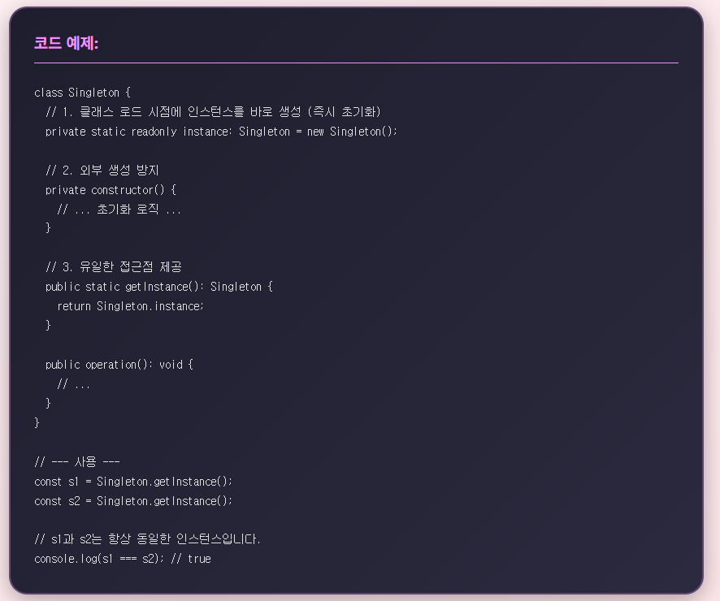
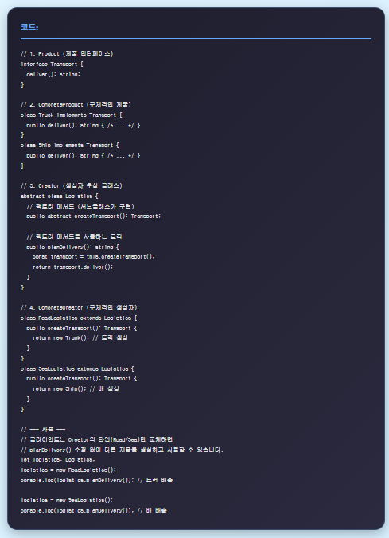
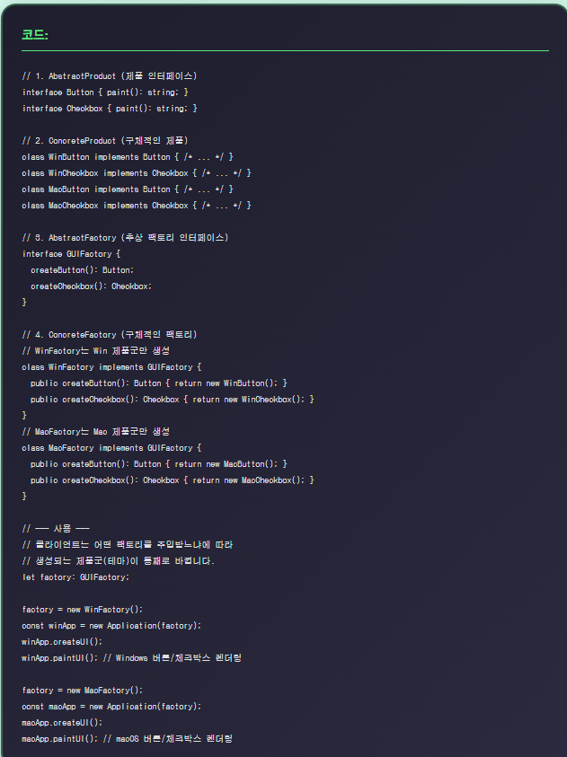
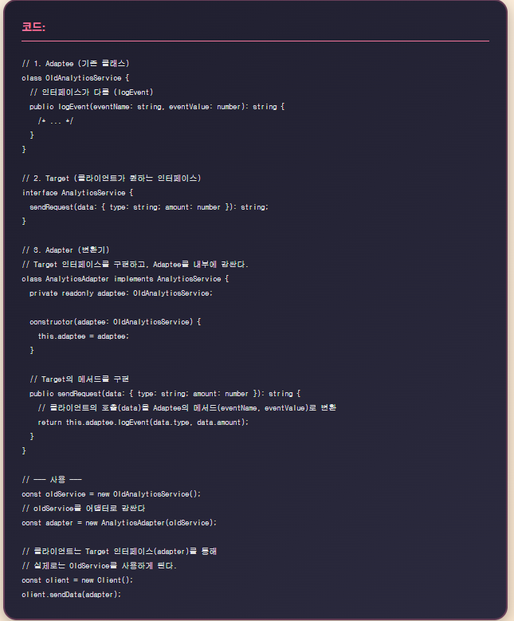
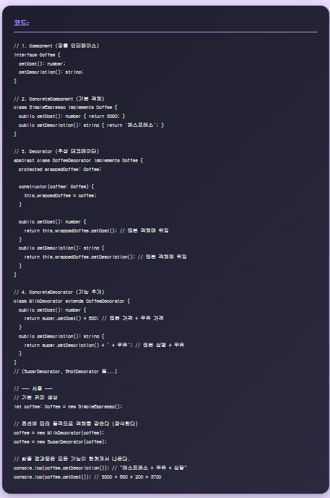
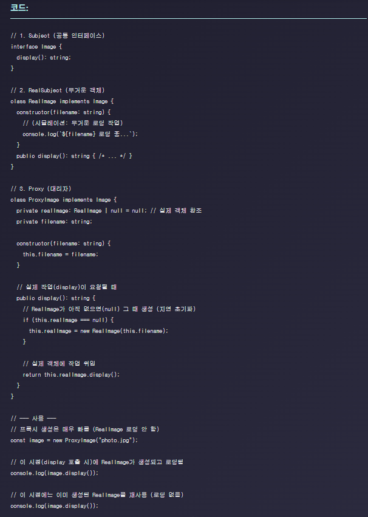
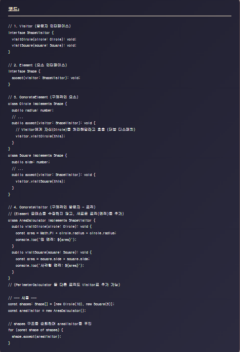
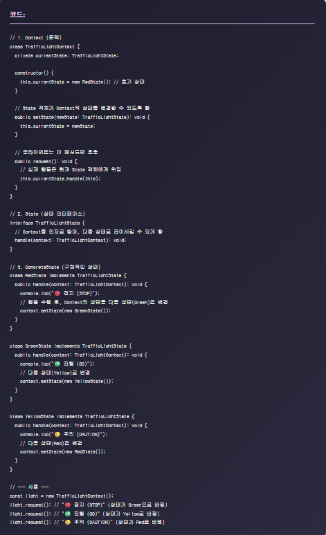

# 🎨 Vue 3 디자인 패턴 예제

Vue 3 + Vite + TypeScript로 구현한 **9가지 디자인 패턴** 학습 프로젝트입니다!
각 패턴마다 알록달록한 테마와 귀여운 UI로 디자인 패턴을 쉽고 재미있게 배울 수 있습니다.

<div align="center">


</div>

---

## ✨ 특징

- 🎀 **9가지 GoF 디자인 패턴** 완벽 구현
- 🌈 **알록달록한 UI/UX** - 각 패턴마다 고유한 색상 테마
- 💫 **인터랙티브한 예제** - 버튼 클릭으로 패턴 동작 확인
- 📝 **코드 예시 제공** - 실제 구현 코드를 바로 확인
- 🎯 **TypeScript 기반** - 타입 안전성과 명확한 인터페이스 정의
- 📱 **반응형 디자인** - 모바일/태블릿/데스크탑 모두 지원

---

## 📚 구현된 디자인 패턴

### 🏗️ 생성 패턴 (Creational Patterns)

| 패턴 | 설명 | 테마 |
|------|------|------|
| 🎀 **Singleton** | 클래스의 인스턴스가 오직 하나만 존재하도록 보장 | 핑크 그라디언트 |
| 🌊 **Factory Method** | 객체 생성을 서브클래스에 위임 | 블루 그라디언트 |
| 🌿 **Abstract Factory** | 관련된 객체 군을 생성하는 인터페이스 제공 | 민트/그린 그라디언트 |

### 🔧 구조 패턴 (Structural Patterns)

| 패턴 | 설명 | 테마 |
|------|------|------|
| 🧡 **Adapter** | 호환되지 않는 인터페이스를 연결 | 코랄/오렌지 그라디언트 |
| 💜 **Decorator** | 객체에 동적으로 새로운 기능 추가 | 퍼플 그라디언트 |
| 🩵 **Proxy** | 다른 객체에 대한 대리자 역할 수행 | 시안 그라디언트 |

### 🎭 행위 패턴 (Behavioral Patterns)

| 패턴 | 설명 | 테마 |
|------|------|------|
| 🌹 **Observer** | 객체 상태 변화를 관찰자에게 자동 통지 | 로즈 그라디언트 |
| 🍑 **Visitor** | 객체 구조에서 알고리즘을 분리 | 피치 그라디언트 |
| 💙 **State** | 객체의 상태에 따라 행동을 변경 | 라벤더 그라디언트 |

---

## 📸 스크린샷

### 🏗️ 생성 패턴 (Creational Patterns)

<div align="center">

#### Singleton Pattern


#### Factory Method Pattern


#### Abstract Factory Pattern


</div>

### 🔧 구조 패턴 (Structural Patterns)

<div align="center">

#### Adapter Pattern


#### Decorator Pattern


#### Proxy Pattern


</div>

### 🎭 행위 패턴 (Behavioral Patterns)

<div align="center">

#### Observer Pattern


#### Visitor Pattern


#### State Pattern


</div>

---

## 🚀 시작하기

### 📋 사전 요구사항

- Node.js 18.x 이상
- npm 또는 yarn

### 📦 설치

```bash
# 저장소 클론
git clone <repository-url>
cd vue-prac3

# 의존성 설치
npm install
```

### 💻 개발 서버 실행

```bash
npm run dev
```

브라우저에서 `http://localhost:5173` 접속

### 🏗️ 프로덕션 빌드

```bash
# 타입 체크 + 빌드
npm run build

# 타입 체크만 실행
npm run type-check

# 빌드만 실행 (타입 체크 없이)
npm run build-only
```

### 🧹 코드 린팅

```bash
npm run lint
```

---

## 📁 프로젝트 구조

```
vue-prac3/
├── src/
│   ├── App.vue                      # 메인 애플리케이션 컴포넌트
│   ├── main.ts                      # 애플리케이션 진입점
│   └── patterns/                    # 디자인 패턴 컴포넌트들
│       ├── singleton-ex.vue         # 싱글톤 패턴
│       ├── factoryMethod-ex.vue     # 팩토리 메서드 패턴
│       ├── abstractFactory-ex.vue   # 추상 팩토리 패턴
│       ├── adaptor-ex.vue          # 어댑터 패턴
│       ├── decorator-ex.vue        # 데코레이터 패턴
│       ├── proxy-ex.vue            # 프록시 패턴
│       ├── observer-ex.vue         # 옵저버 패턴
│       ├── visitor-ex.vue          # 비지터 패턴
│       └── state-ex.vue            # 상태 패턴
├── public/                          # 정적 파일
├── index.html                       # HTML 엔트리 포인트
├── package.json                     # 프로젝트 설정
├── vite.config.ts                   # Vite 설정
├── tsconfig.json                    # TypeScript 설정
└── README.md                        # 이 파일
```

---

## 🎯 학습 가이드

### 각 패턴 학습 방법

1. **탭 선택** - 상단 네비게이션에서 학습하고 싶은 패턴 선택
2. **설명 읽기** - 패턴의 목적과 사용 시나리오 이해
3. **예제 실행** - 버튼을 클릭하여 패턴이 어떻게 동작하는지 확인
4. **코드 확인** - 하단의 코드 섹션에서 실제 구현 확인
5. **실습** - 직접 코드를 수정해보며 패턴 이해도 향상

### 권장 학습 순서

1. **생성 패턴** → Singleton → Factory Method → Abstract Factory
2. **구조 패턴** → Adapter → Decorator → Proxy
3. **행위 패턴** → Observer → Visitor → State

---

## 🛠️ 기술 스택

### Core
- **Vue 3.5.22** - Progressive JavaScript Framework
- **TypeScript 5.9** - JavaScript with syntax for types
- **Vite** - Next Generation Frontend Tooling

### Development Tools
- **ESLint** - Code quality & consistency
- **Prettier** - Code formatting
- **Vue TSC** - TypeScript type checking for Vue

### UI/UX Features
- CSS3 Gradients & Animations
- Responsive Design (Mobile First)
- Custom Component Styling

---

## 🎨 디자인 특징

### 테마 시스템
- 각 패턴마다 **고유한 그라디언트 색상**
- **둥글둥글한 UI** - border-radius 20-30px
- **이모지 데코레이션** - 각 패턴의 특성을 표현

### 인터랙션
- **호버 효과** - 버튼과 탭에 통통 튀는 애니메이션
- **부드러운 전환** - cubic-bezier 애니메이션
- **그림자 효과** - 깊이감 있는 UI

### 코드 가시성
- **다크 모드 코드 블록** - 가독성 높은 구문 강조
- **큰 폰트 크기** - 15-16px 본문, 2rem 제목
- **컬러풀한 출력창** - 그라디언트 배경의 결과 표시

---

## 🌐 브라우저 호환성

- ✅ Chrome / Edge (최신 버전)
- ✅ Firefox (최신 버전)
- ✅ Safari (최신 버전)
- ✅ Opera (최신 버전)

---

## 💡 IDE 설정

### 권장 IDE
- [VS Code](https://code.visualstudio.com/)

### 필수 확장 프로그램
- [Vue - Official](https://marketplace.visualstudio.com/items?itemName=Vue.volar) (Volar)
- [TypeScript Vue Plugin](https://marketplace.visualstudio.com/items?itemName=Vue.vscode-typescript-vue-plugin)

### 권장 확장 프로그램
- [ESLint](https://marketplace.visualstudio.com/items?itemName=dbaeumer.vscode-eslint)
- [Prettier](https://marketplace.visualstudio.com/items?itemName=esbenp.prettier-vscode)

### 브라우저 개발 도구
- **Chrome/Edge/Brave**: [Vue.js devtools](https://chromewebstore.google.com/detail/vuejs-devtools/nhdogjmejiglipccpnnnanhbledajbpd)
- **Firefox**: [Vue.js devtools](https://addons.mozilla.org/en-US/firefox/addon/vue-js-devtools/)

---

## 📖 참고 자료

### 디자인 패턴 학습
- [GoF Design Patterns](https://www.amazon.com/Design-Patterns-Elements-Reusable-Object-Oriented/dp/0201633612)
- [Refactoring.Guru - Design Patterns](https://refactoring.guru/design-patterns)
- [TypeScript Design Patterns](https://www.patterns.dev/posts/classic-design-patterns/)

### Vue 3 학습
- [Vue 3 공식 문서](https://vuejs.org/)
- [Vue 3 Composition API](https://vuejs.org/guide/extras/composition-api-faq.html)
- [TypeScript with Vue](https://vuejs.org/guide/typescript/overview.html)

---

## 📝 라이선스

이 프로젝트는 학습 목적으로 제작되었습니다.

---

## 🤝 기여

버그 리포트, 기능 제안, 개선 사항은 언제든 환영합니다!

---

<div align="center">

**Made with 💖 using Vue 3 + TypeScript**

⭐ 이 프로젝트가 도움이 되었다면 스타를 눌러주세요! ⭐

</div>
